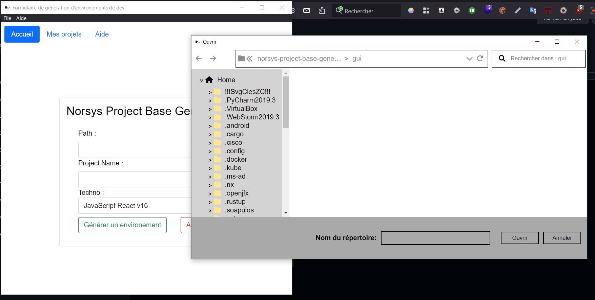

# Norsys Project Base Generator

Application CLI / GUI / Web permétant de générérer un template de projet 
(plusieurs technologies sont disponibles) pour démarrer plus facilement et plus rapidement un projet.



## Linux / MacOS
### CLI
```bash
./norsys-project-base-generator-linux-amd64 <path> <techno>
```
### WEB
```bash
// génère un serveur web sur un port disponible et lance la home page sur votre navigateur par default
./norsys-project-base-generator-linux-amd64
```
### GUI
```bash
// génère un serveur web sur un port disponible et lance la home page sur votre navigateur par default
./norsys-project-base-generator-gui-linux-amd64
```

## Windows
### CLI
```shell
.\norsys-project-base-generator-windows-amd64.exe <path> <techno>
```
### WEB
```shell
// génère un serveur web sur un port disponible et lance la home page sur votre navigateur par default
.\norsys-project-base-generator-windows-amd64.exe
```
### GUI
```shell
// génère un serveur web sur un port disponible et lance la home page sur votre navigateur par default
.\norsys-project-base-generator-gui-windows-amd64.exe
```

## Sitographie
* https://pkg.go.dev/github.com/asticode/go-astilectron
* https://curatedgo.com/r/thanks-to-go-astilectron-asticodego-astilectron/index.html
* https://medium.com/@asticode/how-to-add-a-gui-to-your-golang-app-in-5-easy-steps-c25c99d4d8e0
* https://www.bgs-associes.com/configurer-une-application-avec-apache-php-mysql/
* https://github.com/wellington/go-libsass